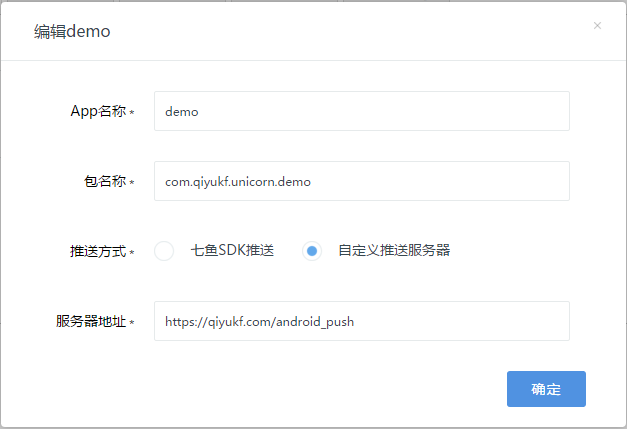

# 网易七鱼 Android SDK 开发指南

## 简介

网易七鱼 Android SDK 是一个 Android 端客服系统访客解决方案，既包含了客服聊天逻辑管理，也提供了聊天界面，开发者可方便的将客服功能集成到自己的 APP 中。

## 快速集成

只需简单 3 步，即可将客服功能加入你的 APP：

1. 添加 SDK 到项目中。
 - Android Studio: 在工程 build.gradle 文件中添加依赖即可。<a href="https://bintray.com/qiyukf/maven/qiyu-android-sdk/_latestVersion" target="_blank"></a>

    ```
    // 最新版本可参考 Download 徽章后对应的数值
    compile 'com.qiyukf.unicorn:unicorn:3.13.0'
    ```

 - Eclipse: 先下载 SDK，然后解压缩，将得到的 unicorn 文件夹作为库工程模块导入到你的工程中，并添加模块依赖。然后将 assets 文件夹的内容拷贝你的主工程的 assets 目录中，将 AndroidManifest 文件中的内容拷贝到你的主工程的 manifest 文件中，并将 manifest 中的 `${applicationId}` 替换为你的包名。

2. 在你的 Application 类的 `onCreate` 函数中，加入以下初始化代码：

    ```
    public class YourApplication extends Application {
       public void onCreate() {
           // ... your codes
           // appKey 可以在七鱼管理系统->设置->APP接入 页面找到
           Unicorn.init(this, "appKey", options(), new UnicornImageLoader());
           // ... your codes
       }

       // 如果返回值为null，则全部使用默认参数。
       private YSFOptions options() {
           YSFOptions options = new YSFOptions();
           options.statusBarNotificationConfig = new StatusBarNotificationConfig();
           return options;
   }
   ```

   上面代码中，UnicornImageLoader 可根据你 APP 中图片加载模块做自定义实现，以免 SDK 中引入第三方图片管理库后造成与 APP 的冲突或者浪费。在 demo 中，实现了依赖于 UniversalImageLoader 的 UILImageLoader。其代码以及依赖于 fresco、Glide、Picasso 的实现代码可参考 [图片加载](#图片加载) 一节。

3. 在你的 APP 的合适页面添加客服入口按钮，并在响应函数中加入如下代码：

    ```
    String title = "聊天窗口的标题";
    /**
     * 设置访客来源，标识访客是从哪个页面发起咨询的，用于客服了解用户是从什么页面进入。
     * 三个参数分别为：来源页面的url，来源页面标题，来源页面额外信息（可自由定义）。
     * 设置来源后，在客服会话界面的"用户资料"栏的页面项，可以看到这里设置的值。
     */
    ConsultSource source = new ConsultSource(sourceUrl, sourceTitle, "custom information string");
    /**
     * 请注意： 调用该接口前，应先检查Unicorn.isServiceAvailable()，
     * 如果返回为false，该接口不会有任何动作
     *
     * @param context 上下文
     * @param title   聊天窗口的标题
     * @param source  咨询的发起来源，包括发起咨询的url，title，描述信息等
     */
    Unicorn.openServiceActivity(context, title, source);
    ```

在打开的页面中，用户就可以咨询客服了。

## SDK包具体内容

```
sdk
├── libs
│   ├── qiyu-sdk-x.y.z.jar
│   └── android-support-v4.jar
├── res
│   └── ***
└── assets
    └── ***
```

上面文件中，qiyu-sdk-x.y.z.jar 是网易七鱼的 SDK 包，res 和 assets 为 SDK 所依赖的资源文件。

android-support-v4.jar 为工程依赖的外部库，所需最低版本为23.0.0（Android 6.0权限管理适配）。如果你的 APP 也依赖了这个 jar 包，可以将你的工程中的依赖移除，或者将这个库移动到一个更基础的库工程中做依赖。如果是使用 Android Studio 接入，SDK 工程的 build.gradle 文件已经添加了依赖，无需理会这个文件。

## 混淆配置

如果你的 apk 最终会经过代码混淆，请在 proguard 配置文件中加入以下代码:

```
-dontwarn com.qiyukf.**
-keep class com.qiyukf.** {*;}
```

## 初始化

网易七鱼 SDK 需要接收消息推送，因此有一个后台进程，进程名为 "packageName:core"。我们知道，Application 的 onCreate 在各个进程中都会被调用，包括 UI 主进程和七鱼的推送进程。在实现 Application 的 onCreate 时，如果需要在 onCreate 中调用除 init 接口外的其他接口，应先判断当前所属进程，并只有在当前是 UI 进程时才调用。SDK 的 init 接口无需做额外判断，SDK 会自动识别是否需要初始化。另外，要注意不要在主进程外的其他进程中再调用 Unicorn 提供的接口（`init` 除外）。判断当前进程是否是在主进程的代码示例如下：

```
public static boolean inMainProcess(Context context) {
    String mainProcessName = context.getApplicationInfo().processName;
    String processName = getProcessName();
    return TextUtils.equals(mainProcessName, processName);
}

/**
 * 获取当前进程名
 */
private static String getProcessName() {
    BufferedReader reader = null;
    try {
        File file = new File("/proc/" + android.os.Process.myPid() + "/" + "cmdline");
        reader = new BufferedReader(new FileReader(file));
        return reader.readLine().trim();
    } catch (IOException e) {
        return null;
    } finally {
        if (reader != null) {
            try {
                reader.close();
            } catch (IOException e) {
                e.printStackTrace();
            }
        }
    }
}
```

初始化包括两个部分，一是本地数据的初始化，二是从七鱼的服务器获取一些配置信息操作。本地数据的初始化是同步的，主要是检查本地是否已经有可以聊天的账号，如果有了，还会做一些缓存数据的初始化操作。如果没有，才会进入到第二部分，去七鱼服务器获取聊天账号。第二部分是异步操作，会在后台自动完成。

## 消息

### 新消息提醒

当用户不处在聊天界面时，收到客服的消息，APP 应当在通知栏或者聊天入口给出提醒。

通知栏提醒可以显示最近一条消息的内容，并提供给用户快速进入 APP 的入口。要打开通知栏提醒功能，只需给 `YSFOptions` 的 `statusBarNotificationConfig` 域赋予非 null 值即可。同时，通过定制该域的各配置项，还能实现提醒开关，免打扰等功能。

要实现点击通知栏提醒直接跳转到会话窗口的功能，需要设置 `StatusBarNotificationConfig` 的 `notificationEntrance`，并在对应的 Activity 里添加处理。如果没有设置 `notificationEntrance`，则是在 `AndroidManifest` 中设置的入口 Activity 中处理。示例代码如下：

```
Intent intent = getIntent();
if (intent.hasExtra(NimIntent.EXTRA_NOTIFY_CONTENT)) {
    // 打开客服窗口
    Unicorn.openServiceActivity(context, title, source);
    // 最好将intent清掉，以免从堆栈恢复时又打开客服窗口
    setIntent(new Intent());
}
```

在聊天入口的地方，APP 可以给出是否有未读消息，以及未读数的提示。APP 可以通过添加以下监听来跟踪未读数变化，更新界面，反馈给用户：

```
// 添加未读数变化监听，add 为 true 是添加，为 false 是撤销监听。
// 退出界面时，必须撤销，以免造成资源泄露
private UnreadCountChangeListener listener = new UnreadCountChangeListener() { // 声明一个成员变量
    @Override
    public void onUnreadCountChange(int count) {
        // 在此更新界面, count 为当前未读数，
        // 也可以用 Unicorn.getUnreadCount() 获取总的未读数
    }
}

private void addUnreadCountChangeListener(boolean add) {
    Unicorn.addUnreadCountChangeListener(listener, add);
}
```

默认情况下，只有访客在聊天界面时，才不会有通知栏提醒，其他界面以及 APP 在后台时，都会有消息提醒。如果当 APP 在前台时，不需要通知栏提醒新消息，可以调用`Unicorn.toggleNotification(false)`关闭消息提醒，然后在 APP 退到后台时，调用`Unicorn.toggleNotification(true)`重新打开。

用户收到新消息后（通过未读数变化监听接口可获知此事件），如果开发者需要显示新收到的消息，可通过下面接口获取最近一条消息：

```
/**
 * 获取和客服的最后一条聊天消息内容。
 * 可用于未读消息变化时，展示最后一条未读消息，或者展示客服的最后一条消息。
 * @return 最后一条消息
 */
UnicornMessage message = Unicorn.queryLastMessage();
```

在 V3.2 版本中增加了该接口的平台商家企业版本，需要传入商家ID，用于平台商家企业调用。

```
/**
 * 获取和客服的最后一条聊天消息内容。
 * 可用于未读消息变化时，展示最后一条未读消息，或者展示客服的最后一条消息。
 *
 * @param shopId 商家ID
 * @return 最后一条消息
 */
UnicornMessage message = POPManager.queryLastMessage(String shopId);
```

### 清除缓存文件

在 V3.4 版本中七鱼 SDK 增加了接收文件功能，为了防止文件过多占用用户手机存储空间，我们增加了清除缓存文件接口

```
/**
 * 清除文件缓存，将删除SDK接收过的所有文件。<br>
 * 建议在工作线程中执行该操作。
 */
Unicorn.clearCache();
```

## 定制界面

### 客服窗口UI自定义

为了咨询客服窗口的界面风格能与集成七鱼 SDK 的 APP 能够整体统一，七鱼 SDK 提供了简洁的 UI 自定义配置选项。

配置选项接口名为 UICustomization，配置参数放在 `YSFOptions` 的 `uiCustomization` 变量中，开发者可在初始化 SDK 或者在运行时任意时候修改配置，当需要与 SDK 提供的默认界面不一样表现的地方，就修改对应的项，否则不赋值即可，界面会保留默认表现。修改各设置项后，都需要等到下次进入会话界面才会看到相应的更改。

各配置项说明如下：

| 参数名 | 类型 | 参数说明 | 取值说明 |
| :-----| :-----| :-----| :-----|
| msgBackgroundUri | String | 客服消息窗口背景图片设置 | uri（支持格式见表后）|
| msgBackgroundColor | int | 客服消息窗口颜色。如果同时设置 uri 和颜色，优先使用 uri | 32 位颜色值 |
| msgListViewDividerHeight | int | 消息列表消息项间距 | 单位为 pixel |
| hideLeftAvatar | boolean | 是否隐藏左侧(客服消息)头像 | 默认为 false，不隐藏 |
| hideRightAvatar | boolean | 是否隐藏右侧(访客消息)头像 | 默认为 false，不隐藏 |
| avatarShape | int | 头像形状风格 | 0为圆形头像，1为方形头像 |
| leftAvatar | String | 左侧 （客服消息）头像图片 uri | uri（支持格式见表后） |
| rightAvatar | String | 右侧 （访客消息）头像图片 uri | uri（支持格式见表后） |
| tipsTextColor | int | 提示类消息的字体颜色（包括分配客服消息，消息时间标签等）| 32 位颜色值 |
| tipsTextSize | float | 提示类消息的字体大小（包括分配客服消息，消息时间标签等）| 单位为 sp |
| msgItemBackgroundLeft | int | 左边消息项背景, 最好是 selector，同时影响文本和语音消息。 | drawable resId |
| msgItemBackgroundRight | int | 右边消息项背景, 最好是 selector，同时影响文本和语音消息。 | drawable resId |
| audioMsgAnimationLeft | int | 左侧语音消息播放时候的动画 animation-list,没有播放时显示最后一帧 | drawable resId |
| audioMsgAnimationRight | int | 右侧语音消息播放时候的动画 animation-list,没有播放时显示最后一帧 | drawable resId |
| textMsgColorLeft | int | 左侧文本消息颜色 | 32 位颜色值 |
| hyperLinkColorLeft | int | 左侧文本消息中超链接的颜色 | 32 位颜色值 |
| textMsgColorRight | int | 右侧文本消息颜色 | 32 位颜色值 |
| hyperLinkColorRight | int | 右侧文本消息中超链接的颜色 | 32 位颜色值 |
| textMsgSize | float | 文本消息字体大小 | 单位为sp |
| inputTextColor | int | 底部消息输入框的字体颜色 | 32 位颜色值 |
| inputTextSize | float | 底部消息输入框的字体大小 | 单位为sp |
| topTipBarBackgroundColor | int | 顶部提示栏(没有客服，排队状态等)背景色 | 32 位颜色值 |
| topTipBarTextColor | int | 顶部提示栏文字颜色 | 32 位颜色值 |
| topTipBarTextSize | float | 顶部提示栏文字大小 | 单位为 sp |
| titleBackgroundResId | int | 标题栏背景图 | drawable resId|
| titleBackgroundColor | int | 标题栏背景颜色，如果同时设置 drawable 和颜色，优先使用 drawable | 32 位颜色值 |
| titleBarStyle | int | 标题栏风格，影响标题和标题栏上按钮的颜色 | 目前支持： 0浅色系，1深色系 |
| titleCenter | boolean | 标题居中 | 如果为 true ，居中，否则（默认）居左 |
| buttonBackgroundColorList | int | 发送，选择，预览等按钮的颜色 | ColorStateList，可参考 SDK 的 ysf\_button\_color\_state\_list |
| buttonTextColor | int | 发送，选择，预览等按钮的文字颜色 | 32 位颜色值 |
| hideAudio| boolean | 是否隐藏语音输入栏 | 默认为 false，不隐藏 |
| hideAudioWithRobot | boolean | 在机器人聊天界面是否隐藏输入栏 | 默认为false，不隐藏。给机器人发送语音后，会先转成文字消息，再发送给机器人 |
| hideEmoji | boolean | 是否隐藏表情输入栏 | 默认为 false，不隐藏 |
| screenOrientation | int | 屏幕旋转角度 | 0 为仅竖屏显示，1为仅横屏显示，2为根据重力感应切换|
| hideKeyboardOnEnterConsult | boolean | 在进入聊天界面时是否隐藏输入键盘 | 默认为 false，进入时就自动弹出键盘|

> 图片 uri 支持的格式由开发者根据自己使用的图片加载框架定义。但必须要支持 file://， http:// 和 https:// 这3种。

### 其他界面

SDK 的所有资源文件名均以 nim 或者 ysf 作为前缀，colors 和 strings 中的常量也以 nim 或 ysf 为前缀，以避免污染开发者的资源名字空间。

聊天界面的根 layout 文件为 ysf\_message\_fragment.xml, 通过修改该文件，以及其引用的各子 layout 文件，可以修改聊天界面的框架布局。通过修改其中引用的素材资源，可以修改界面的上各图标，字体，背景等。

SDK 自带的会话界面为 ServiceMessageActivity, 其 theme 为 ysf_window_theme, 如果需要修改标题栏样式，可以修改该 style。 该 style 位于 ysf_styles.xml 中。

如果修改 SDK 中的资源文件，以后升级 SDK 时要注意重新替换，以免又回到默认界面上。

SDK 还提供了以 fragment 嵌入的方式集成会话界面，开发者可以更灵活的使用 SDK。示例代码如下：

```
String title = "聊天窗口的标题";
// 访客来源信息
ConsultSource source = new ConsultSource(sourceUrl, sourceTitle, "custom information string");
/**
 * 构造一个 ViewGroup，用于放置sdk的评价和人工客服按钮。
 * 该控件推荐放在标题栏右边。可以用以下两种方式：
 * 1. 将 container 放到 layout 文件中
 * LinearLayout sdkIconContainer = (LinearLayout)findViewById(R.id.xxx);
 * 2. 动态构建，动态添加
 * LinearLayout sdkIconContainer = new LinearLayout(this);
 * sdkIconContainer.setOrientation(LinearLayout.HORIZONTAL);
 * 构造好后，还需要将 ViewGroup 添加到你的 Activity 中
 */
ServiceMessageFragment fragment = Unicorn.newServiceFragment(title, source, sdkIconContainer);
FragmentManager fm = getSupportFragmentManager();
FragmentTransaction transaction = fm.beginTransaction();
// 将 fragment 放到对应的 containerId 中。containerId 为 ViewGroup 的 resId
transaction.replace(containerId, fragment);
try {
    transaction.commitAllowingStateLoss();
} catch (Exception e) {
}
```

### 人工客服快捷入口

在 3.13 版本中，七鱼 SDK 新增人工客服模式下的快捷入口，可用于用户选择并发送订单给客服。

快捷入口位于输入框上方，仅在人工客服和留言状态下显示。如果需要展示快捷入口，需要按照以下方法配置：

1. 为 `ConsultSource` 中的 `quickEntryList` 赋值，添加快捷入口

```
ConsultSource source = new ConsultSource(uri, title, custom);
...
source.quickEntryList = new ArrayList<>();
source.quickEntryList.add(new QuickEntry(0, "查订单", iconUrl));
source.quickEntryList.add(new QuickEntry(1, "查物流", iconUrl));
```

2. 为 `YSFOptions` 中的 `quickEntryListener` 赋值，用于监听快捷入口点击

```
YSFOptions options = new YSFOptions();
...
options.quickEntryListener = new QuickEntry.Listener() {
    @Override
    public void onClick(Context context, String shopId, QuickEntry quickEntry) {
        ToastUtils.show("点击快捷入口" + quickEntry.getId());
        if (quickEntry.getId() == 0) {
            // 这里可根据 QuickEntry 做出相应的相应，如打开订单选择窗口
        }
    }
};
```

如果需要在用户选择订单后将商品信息发送给客服，需要调用以下接口

```
// 普通企业
Unicorn.sendProductMessage(ProductDetail);

// 平台企业
POPManager.sendProductMessage(shopId, ProductDetail);
```

## 关联商户用户信息

### 关联用户和资料

七鱼 SDK 允许 APP 的用户以匿名方式向客户咨询，但如果 APP 希望客服知道咨询的用户的身份信息，可以通过 SDK 提供的 `setUserInfo` 接口告诉给客服。 该接口包含两个功能：
1. 关联用户账户。调用过该接口后，客服即可知道当前用户是谁，并可以调看该用户之前发生过的访问记录。通过该接口，SDK还会把 APP 端相同用户 ID 的咨询记录整合在一起。如果调用 `setUserInfo` 接口前是匿名状态，那么匿名状态下的聊天记录也会被整合到新设置的这个用户下面。
2. 提供用户的详细资料。通过设置参数 `YSFUserInfo` 的 data 字段， APP 能把用户的详细信息告诉给客服，这些信息会显示在客服会话窗口的用户信息栏中。该字段具有很强的可扩展性，具体请见本节后面的描述。

为了区分不同的 APP 用户，当 APP 端用户注销后，需要先调用 `Unicorn.logout()`，告诉 SDK，SDK 此时会关闭前一个用户的聊天记录，并重新分配一个新的聊天账号，以和之前的用户区分。

**注意，该接口不允许直接从一个账号切换到另外一个账号。**

为了方便开发者调用，这个接口没有设置回调接口，开发者也无需在用户资料发生变更后就调用该接口。开发者可在每次打开客服窗口时调用该函数，设置访客资料。SDK会缓存上次设置的资料，只有当资料发生改动时SDK才会上传，以节省流量。

访客信息为一个 json 数组，该数组中的 item 目前可包含以下字段：
- key: 数据项的名称，用于区别不同的数据。
- index: 用于排序，显示数据时数据项按index值升序排列；不设定index的数据项将排在后面；index相同或未设定的数据项将按照其在 JSON 中出现的顺序排列。
- label: 该项数据显示的名称。
- value: 该数据显示的值，类型不做限定，根据实际需要进行设定。
- href: 超链接地址。若指定该值，则该项数据将显示为超链接样式，点击后跳转到其值所指定的 URL 地址。
- hidden: 是否隐藏该item。目前仅对mobile和email有效。

现在，以下4个key由七鱼使用，他们的排序和标签名是固定的，不能指定index和label。
- real\_name: 用户姓名。
- mobile\_phone：用户手机号，可以隐藏。
- email：用户的邮箱账号，可以隐藏。
- avatar: 用户的头像，可以在客服端显示。访客端的用户头像不会使用该字段。

设置访客信息的示例如下：

```
YSFUserInfo userInfo = new YSFUserInfo();
// APP 的用户 ID
userInfo.userId = "uid";
// 当且仅当开发者在管理后台开启了 authToken 校验功能时，该字段才有效
userInfo.authToken = "auth-token-from-user-server";
// CRM 扩展字段
userInfo.data="[
    {"key":"real_name", "value":"土豪"},
    {"key":"mobile_phone", "hidden":true},
    {"key":"email", "value":"13800000000@163.com"},
    {"key":"avatar", "value": "https://qiyukf.com/def_avatar.png"},
    {"index":0, "key":"account", "label":"账号", "value":"zhangsan" , "href":"http://example.domain/user/zhangsan"},
    {"index":1, "key":"sex", "label":"性别", "value":"先生"},
    {"index":5, "key":"reg_date", "label":"注册日期", "value":"2015-11-16"},
    {"index":6, "key":"last_login", "label":"上次登录时间", "value":"2015-12-22 15:38:54"}
]";
Unicorn.setUserInfo(userInfo);
```

### 注销

如前所述，当关联的用户从 APP 注销后，也应当调用 SDK 的注销接口 `Unicorn.logout()`。这样，注销之后，客服再给前面用户发送消息，将进入留言，等到该用户下次再在同一台设备上登录后，能够再看到。如果 APP 的用户注销后，不调用七鱼的 logout 接口，七鱼不知道用户已经变更，那么客服如果给前面一个用户发起会话，发送消息，当前设备将仍旧能够收到消息，造成混乱。

`Unicorn.logout()` 接口等效于 `Unicorn.setUserInfo(null)`。

注意：目前不支持跨设备的消息漫游，在其他设备上通过 `setUserInfo(YSFUserInfo)` 设置相同的用户, 这个设备上不能收到留言。


## 自定义客服分配

在打开客服咨询窗口或者构造 `ServiceMessageFragment` 时，接口中有一个参数是 `ConsultSource`，通过该参数，我们可以对分配客服的流程做一些自定义操作。

### 指定客服（组）

在 2.0 之前的版本中，请求客服时会根据企业在管理后台上对 APP 客服分配的设置，来决定首先接入机器人还是人工客服，如果管理后台开启了机器人，则首先会接入机器人。如果管理后台也允许接入人工客服，那么用户可以通过回复 'RG' 或者 '人工客服' 一类的关键字切换到人工客服，界面上也能展现一个人工客服的入口，用户点击此入口，也能接入人工客服。

在 2.0 版本中，七鱼加入了访客分配的逻辑。如果APP端开启了访客分配，那么当切换到人工客服时，会首先给出一个客服分组选择的入口，用户可以自主选择某个客服或者客服分组咨询。

在 2.2 版本中，SDK 在 `ConsultSource` 增加了指定客服或者客服组的参数，开发者可以在访客进入咨询界面前就指定好要为其服务的客服，例如从订单页面打开咨询界面时为其指定售后客服，在商品页面打开时，为其指定售前客服。在 `ConsultSource` 中，`staffId` 为客服 ID，`groupId` 为客服组 ID，其值可以在管理后台设置页面的「访客分配」页面中找到。如果这两个参数都没有设置，则按照2.0版本的逻辑分配客服，如果指定了其中一个，则只会分配指定的客服或者在指定的客服分组中分配，如果指定的客服不在线，或者指定的客服分组中没有客服在线，则会提示用户客服不在线。如果同时指定 `staffId` 和 `groupId`，以 `staffId` 为准，忽略 `groupId`。

在 3.1 版本中，SDK 又在 `ConsultSource` 中增加了 robotFirst 参数， 如果指定了 groupId 或者 staffId 时，该参数有效。如果 robotFirst 为 `true`，则会先由机器人接待，如果之后如果用户转人工服务，再分配给上面指定的groupId 或者 staffId。

在 3.1 版本中，为了提高机器人的效率，在 `ConsultSource` 中还增加了 faqGroupId 参数。 faq 由客服人员在管理后台配置。如果指定了此参数，且请求客服为机器人客服，则会下发该 ID 对应的热门问题列表。

### 指定机器人

在 3.12 版本中，为了满足企业不同业务，在 `ConsultSource` 中增加了 robotId 参数，用于指定特定的机器人客服。机器人 ID 可以在管理后台 - 设置 - App接入 中查看。

### 汇报商品信息

在打开咨询窗口时，还可以带上用户当前正在浏览的商品或订单信息。在 `ConsultSource` 中，设置字段为 `productDetail`，其类型为 `ProductDetail`。各字段通过 `ProductDetail.Builder` 设置，可以设置的信息有：

|字段|意义|备注|
|:----|:----|:----|
|title|商品标题|长度限制为 100 字符，超过自动截断。|
|desc|商品详细描述信息。|长度限制为 300 字符，超过自动截断。|
|note|商品备注信息（价格，套餐等）|长度限制为 100 字符，超过自动截断。|
|picture|缩略图图片的 url。|该 url 需要没有跨域访问限制，否则在客服端会无法显示。<br> 长度限制为 1000 字符， 超长不会自动截断，但会发送失败。|
|url|商品信息详情页 url。|长度限制为 1000 字符，超长不会自动截断，但会发送失败。|
|show| 是否在访客端显示商品消息。|默认为0，即客服能看到此消息，但访客看不到，也不知道该消息已发送给客服。|
|alwaysSend|在会话开始后，仍可以发送该商品字段| 默认为 false，不发送。|

在3.1.0版本之前，商品信息只有在连上客服时发送一次，此后如果没有重新连接客服，无论商品信息是否改变，都不会再继续发送了。从3.1.0版本开始，开发者可以通过 `alwaysSend` 字段控制是否需要在中途发送新的商品信息。注意，如果上一次发送的商品链接和这一次的相同，后面一次的不会再发送给客服。

### 设置用户VIP等级

在 3.5 版本中，七鱼客服增加了设置用户 VIP 等级的功能，便于区分用户等级，允许 VIP 用户优先进线或为 VIP 用户指定专线客服，提升用户体验。

使用该功能需要在七鱼管理系统 -> 设置 -> VIP 客户设置页面打开 VIP 开关，否则设置将不会生效。

设置用户 VIP 等级需要为 `ConsultSource` 中的 `vipLevel` 字段赋值：

- 如果为 0，为普通用户；
- 如果为 1-10，为用户 VIP 等级 1-10 级；
- 如果为 11，为通用 VIP 用户，即不显示用户等级。

### 控制会话过程

从 3.5.5 版本开始，SDK 增加了开发者对于会话过程控制的力度，允许用户主动结束会话和主动退出排队。

控制会话过程的设置类是 `SessionLifeCycleOptions`，可以在开始会话前设置给 `ConsultSource` 的 `sessionLifeCycleOptions` 字段。示例代码如下：

```
ConsultSource source = new ConsultSource(null, "自定义入口", null);
SessionLifeCycleOptions lifeCycleOptions = new SessionLifeCycleOptions();
lifeCycleOptions.setCanCloseSession(boolean)
        .setCanQuitQueue(boolean)
        .setQuitQueuePrompt(String);
source.sessionLifeCycleOptions = lifeCycleOptions;
Unicorn.openServiceActivity(context, title, source);
```

如果使用 fragment 集成，则还需要对`SessionLifeCycleOptions`的`sessionLifeCycleListener`字段赋值，配置`会话界面退出监听器`，详见`SessionLifeCycleListener`。


## 图片加载

图片加载基本上每个 APP 都会用到，各个 APP 也都会有自己的实现或者依赖的第三方库。为了避免 SDK 引入第三方图片库后，与 APP 自身依赖的图片库冲突，或者与 APP 用了不同的库造成浪费，从 2.0.0 版本开始，七鱼 SDK 需要由 APP 实现一个图片加载接口，并传给 YSFOptions。 下面是两个常用的第三方图片加载库的接口实现示例，开发者可以直接使用。

图片加载参数中的 uri 格式，只要是 APP 选用的图片框架支持即可。但请注意，必须支持本地文件 uri （file://）和 网络文件 uri (http:// 或者 https://) 这两种格式。

### UniversalImageLoader实现

该实现依赖 universal-image-loader 库，需要在工程的 build.gradle 文件中添加依赖：

```
compile 'com.nostra13.universalimageloader:universal-image-loader:1.9.5'
```

如果使用的 IDE 是 Eclipse，则需要在 libs 中添加 universal-image-loader 的 jar 包。

```java
public class UILImageLoader implements UnicornImageLoader {
    private static final String TAG = "UILImageLoader";

    @Override
    public Bitmap loadImageSync(String uri, int width, int height) {
        DisplayImageOptions options = new DisplayImageOptions.Builder()
                .cacheInMemory(true)
                .cacheOnDisk(false)
                .bitmapConfig(Bitmap.Config.RGB_565)
                .build();

        // check cache
        boolean cached = true;
        ImageDownloader.Scheme scheme = ImageDownloader.Scheme.ofUri(uri);
        if (scheme == ImageDownloader.Scheme.HTTP
                || scheme == ImageDownloader.Scheme.HTTPS
                || scheme == ImageDownloader.Scheme.UNKNOWN) {
            // non local resource
            cached = MemoryCacheUtils.findCachedBitmapsForImageUri(uri, ImageLoader.getInstance().getMemoryCache()).size() > 0
                    || DiskCacheUtils.findInCache(uri, ImageLoader.getInstance().getDiskCache()) != null;
        }

        if (cached) {
            ImageSize imageSize = (width > 0 && height > 0) ? new ImageSize(width, height) : null;
            Bitmap bitmap = ImageLoader.getInstance().loadImageSync(uri, imageSize, options);
            if (bitmap == null) {
                Log.e(TAG, "load cached image failed, uri =" + uri);
            }
            return bitmap;
        }

        return null;
    }

    @Override
    public void loadImage(String uri, int width, int height, final ImageLoaderListener listener) {
        DisplayImageOptions options = new DisplayImageOptions.Builder()
                .cacheInMemory(true)
                .cacheOnDisk(false)
                .bitmapConfig(Bitmap.Config.RGB_565)
                .build();
        ImageSize imageSize = (width > 0 && height > 0) ? new ImageSize(width, height) : null;

        ImageLoader.getInstance().loadImage(uri, imageSize, options, new SimpleImageLoadingListener() {
            @Override
            public void onLoadingComplete(String imageUri, View view, Bitmap loadedImage) {
                super.onLoadingComplete(imageUri, view, loadedImage);
                if (listener != null) {
                    listener.onLoadComplete(loadedImage);
                }
            }

            @Override
            public void onLoadingFailed(String imageUri, View view, FailReason failReason) {
                super.onLoadingFailed(imageUri, view, failReason);
                if (listener != null) {
                    listener.onLoadFailed(failReason.getCause());
                }
            }
        });
    }
}
```

### fresco实现

fresco 库本身提供了一整套图片缓存和加载的功能，由于 SDK 中部分 ImageView 需要做自定义的绘制，因此只会用到其下载，解码和缓存的逻辑。

该实现依赖 fresco 库，需要在工程的 build.gradle 文件中添加依赖：

```
compile 'com.facebook.fresco:fresco:0.9.0'
```

如果使用的 IDE 是 Eclipse，则需要在 libs 中添加 fresco 的 jar 包。

```java
public class FrescoImageLoader implements UnicornImageLoader {
    private Context context;

    public FrescoImageLoader(Context context) {
        this.context = context.getApplicationContext();
    }

    @Override
    public Bitmap loadImageSync(String uri, int width, int height) {
        Bitmap resultBitmap = null;
        ImagePipeline imagePipeline = Fresco.getImagePipeline();
        boolean inMemoryCache = imagePipeline.isInBitmapMemoryCache(Uri.parse(uri));
        if (inMemoryCache) {
            ImageRequestBuilder builder = ImageRequestBuilder.newBuilderWithSource(Uri.parse(uri));
            if (width > 0 && height > 0) {
                builder.setResizeOptions(new ResizeOptions(width, height));
            }
            ImageRequest imageRequest = builder.build();
            DataSource<CloseableReference<CloseableImage>> dataSource =
                    imagePipeline.fetchImageFromBitmapCache(imageRequest, context);
            CloseableReference<CloseableImage> imageReference = dataSource.getResult();
            try {
                if (imageReference != null) {
                    CloseableImage closeableImage = imageReference.get();
                    if (closeableImage != null && closeableImage instanceof CloseableBitmap) {
                        Bitmap underlyingBitmap = ((CloseableBitmap) closeableImage).getUnderlyingBitmap();
                        if (underlyingBitmap != null && !underlyingBitmap.isRecycled()) {
                            resultBitmap = underlyingBitmap.copy(Bitmap.Config.RGB_565, false);
                        }
                    }
                }
            } finally {
                dataSource.close();
                CloseableReference.closeSafely(imageReference);
            }
        }
        return resultBitmap;
    }

    @Override
    public void loadImage(String uri, int width, int height, final ImageLoaderListener listener) {
        ImageRequestBuilder builder = ImageRequestBuilder.newBuilderWithSource(Uri.parse(uri));
        if (width > 0 && height > 0) {
            builder.setResizeOptions(new ResizeOptions(width, height));
        }
        ImageRequest imageRequest = builder.build();

        ImagePipeline imagePipeline = Fresco.getImagePipeline();
        DataSource<CloseableReference<CloseableImage>> dataSource = imagePipeline.fetchDecodedImage(imageRequest, context);

        BaseBitmapDataSubscriber subscriber = new BaseBitmapDataSubscriber() {
            @Override
            public void onNewResultImpl(@Nullable Bitmap bitmap) {
                if (listener != null) {
                    new AsyncTask<Bitmap, Void, Bitmap>() {
                        @Override
                        protected Bitmap doInBackground(Bitmap... params) {
                            Bitmap bitmap = params[0];
                            Bitmap result = null;
                            if (bitmap != null && !bitmap.isRecycled()) {
                                result = bitmap.copy(Bitmap.Config.RGB_565, false);
                            }
                            return result;
                        }

                        @Override
                        protected void onPostExecute(Bitmap bitmap) {
                            if (bitmap != null) {
                                listener.onLoadComplete(bitmap);
                            } else {
                                listener.onLoadFailed(null);
                            }
                        }
                    }.execute(bitmap);
                }
            }

            @Override
            public void onFailureImpl(DataSource dataSource) {
                if (listener != null) {
                    listener.onLoadFailed(dataSource.getFailureCause());
                }
            }
        };

        dataSource.subscribe(subscriber, UiThreadImmediateExecutorService.getInstance());
    }
}
```

### Glide实现

该实现依赖 Glide 库，需要在工程的 build.gradle 文件中添加依赖：

```
compile 'com.github.bumptech.glide:glide:3.7.0'
```

如果使用的 IDE 是 Eclipse，则需要在 libs 中添加 Glide 的 jar 包。

```java
public class GlideImageLoader implements UnicornImageLoader {
    private Context context;

    public GlideImageLoader(Context context) {
        this.context = context.getApplicationContext();
    }

    @Nullable
    @Override
    public Bitmap loadImageSync(String uri, int width, int height) {
        return null;
    }

    @Override
    public void loadImage(String uri, int width, int height, final ImageLoaderListener listener) {
        Glide.with(context).load(uri).asBitmap().into(new SimpleTarget<Bitmap>(width, height) {
            @Override
            public void onResourceReady(Bitmap resource, GlideAnimation<? super Bitmap> glideAnimation) {
                if (listener != null) {
                    listener.onLoadComplete(resource);
                }
            }

            @Override
            public void onLoadFailed(Exception e, Drawable errorDrawable) {
                if (listener != null) {
                    listener.onLoadFailed(e);
                }
            }
        });
    }
}
```

### Picasso实现

该实现依赖 Picasso 库，需要在工程的 build.gradle 文件中添加依赖：

```
compile 'com.squareup.picasso:picasso:2.5.2'
```

如果使用的 IDE 是 Eclipse，则需要在 libs 中添加 Picasso 的 jar 包。

```java
public class PicassoImageLoader implements UnicornImageLoader {
    private static final int CPU_COUNT = Runtime.getRuntime().availableProcessors();
    private Context context;
    private ExecutorService threadPool;
    private Handler uiHandler;

    public PicassoImageLoader(Context context) {
        this.context = context.getApplicationContext();
        uiHandler = new Handler(Looper.getMainLooper());
        threadPool = Executors.newFixedThreadPool(CPU_COUNT + 1);
    }

    @Nullable
    @Override
    public Bitmap loadImageSync(String uri, int width, int height) {
        return null;
    }

    @Override
    public void loadImage(final String uri, final int width, final int height, final ImageLoaderListener listener) {
        threadPool.execute(new Runnable() {
            @Override
            public void run() {
                RequestCreator requestCreator = Picasso
                        .with(context)
                        .load(uri)
                        .config(Bitmap.Config.RGB_565);
                if (width > 0 && height > 0) {
                    requestCreator = requestCreator
                            .resize(width, height)
                            .centerCrop();
                }

                Bitmap bitmap = null;
                try {
                    bitmap = requestCreator.get();
                } catch (IOException e) {
                    e.printStackTrace();
                }

                if (listener == null) {
                    return;
                }

                if (bitmap != null && !bitmap.isRecycled()) {
                    final Bitmap finalBitmap = bitmap;
                    uiHandler.post(new Runnable() {
                        @Override
                        public void run() {
                            listener.onLoadComplete(finalBitmap);
                        }
                    });
                } else {
                    uiHandler.post(new Runnable() {
                        @Override
                        public void run() {
                            listener.onLoadFailed(null);
                        }
                    });
                }
            }
        });
    }
}
```


## 省电策略

七鱼 SDK 作为用户端的 IM 工具，需要能够及时收到客服回复的消息。同时，就算用户没有主动咨询过客服，客服也可以主动发起会话，进行主动营销。因此，在 2.0 版本之前，SDK一旦初始化之后，会一直保持长连接，定时与服务器交换心跳。

但是，毕竟用户咨询以及客服主动营销都是不太常用的操作，为此保持一个长连接，性价比不高。同时，我们了解到，很多客户的 APP 本身就自带了推送模块，或者集成了第三方的推送 SDK，由此就存在了两条长连接，浪费了用户的电量和流量。因此，在2.0版本中，我们针对 SDK 的长连接策略做了更改，以优化在用户没有发起咨询时的电量消耗。如果开发者需要开启省电特性，需要在 `YSFOptions` 中设置 `savePowerConfig`。从版本3.1.0开始，该选项默认开启，并使用默认间隔。

在咨询客服时，SDK 会保持长连接以便及时收到推送。当一次会话结束后，用户极有可能还会继续发起咨询会话，同时客服也很有可能会主动发起会话，因此，一次会话结束后，长连接可以在继续保持一段时间(`SavePowerConfig.activeDelay`)，以便及时收到消息，同时也可以减少重新连接造成的消耗。如果在这段时间内，再也没有开始过会话，则在计时结束后即可转入省电模式。根据用户配置，省电模式分为两种状态：
1. 推送模式：用户需要在七鱼的管理后台配置推送服务器，且 `SavePowerConfig.customPush` 设置为 true。此时，如果有新消息，会自动转到后台配置的推送通道上。由于推送不受 SDK 控制，因此收到推送后 SDK 不会自动建立长连接，需要用户进入咨询界面后，才会建立长连接。开启自定义推送后，还需要设置推送的设备 ID：`SavePowerConfig.deviceIdentifier`。在七鱼推送的消息结构体中，会包含该字段。 
2. 轮询模式：SDK 每隔 `SavePowerConfig.checkInterval` 秒去服务器检测一次有没有新消息。如果有新消息，会自动建立长连接，并收取新消息，弹出通知。

### 配置推送服务器地址

客服发送消息给用户，而用户此时已经转入推送模式后，消息将被推送给开发者的服务器端，然后再由开发者推送到 APP 端。

要配置推送服务器，请使用管理员帐号登录七鱼管理后台，在「设置」 -> 「APP设置」 -> 「添加/编辑APP」中设置。



>开发者服务器收到推送请求后，应对立即返回一个 **空字符串** 告诉七鱼服务器。七鱼服务器发出 POST 请求后，如果在 10 秒内收不到响应，或者收到的响应非空，会断掉连接，并且重新发起请求，总共重试 2 次。 如果连续 10 次都推送失败，该推送服务器 url 将被暂停推送 1 个小时。

### 推送消息数据结构

当有消息需要推送时，七鱼服务器会向开发者设置的服务器地址发送推送消息，方法类型为 POST，数据格式为 JSON 。

POST 请求会包含以下参数：

|参数|参数说明|
|:----|:----|
|nonce|随机数字符串|
|time|当前 UTC 时间戳，从 1970 年 1 月 1 日 0 点 0 分 0 秒开始到现在的秒数|
|checksum|SHA1(AppSecret + nonce + time), 三个参数拼接的字符串，进行SHA1哈希计算，转化成16进制字符(String，小写)|

其中，checksum 可用于校验该请求是否由七鱼服务器发出，出于安全性考虑，还应根据 time 参数校验 checksum 的有效期，超过一定时间（比如 5 分钟）的请求也应判定为非法。请确认发起请求的服务器是与标准时间同步的，比如有NTP服务。

**重要提示: 本文档中提供的所有接口均面向开发者服务器端调用，用于计算CheckSum的AppSecret开发者应妥善保管,可在应用的服务器端存储和使用，但不应存储或传递到客户端，也不应在网页等前端代码中嵌入。**

计算 checksum 的 java 示例代码如下：

 ```java
 public class QiyuPushCheckSum {
    private static final char[] HEX_DIGITS = {'0', '1', '2', '3', '4', '5', '6', '7', '8', '9', 'a', 'b', 'c', 'd', 'e', 'f'};

    public static String encode(String appSecret, String nonce, String time) {
        String content = appSecret + nonce + time;
        try {
            MessageDigest messageDigest = MessageDigest.getInstance("sha1");
            messageDigest.update(content.getBytes());
            return getFormattedText(messageDigest.digest());
        } catch (Exception e) {
            throw new RuntimeException(e);
        }
    }

    private static String getFormattedText(byte[] bytes) {
        int len = bytes.length;
        StringBuilder buf = new StringBuilder(len * 2);
        for (int j = 0; j < len; j++) {
            buf.append(HEX_DIGITS[(bytes[j] >> 4) & 0x0f]);
            buf.append(HEX_DIGITS[bytes[j] & 0x0f]);
        }
        return buf.toString();
    }
}
 ```

POST 请求的内容为 JSON 格式，编码格式为 UTF-8，其各个字段说明如下：

|字段|字段说明|
|:----|:----|
|content|推送的消息内容|
|time|消息的发出时间|
|messageId|消息的唯一 ID，当消息有重发时，开发者的推送服务器可依据此去重。|
|staffName|说话的客服昵称|
|deviceIdentifier|消息发送对象用户的 deviceIdentifier|
|package|消息接收对象 APP 的 package name|


## 自定义响应事件

为了让用户在使用七鱼 SDK 时拥有更大的灵活性，我们将持续添加更多的事件自定义响应接口。

### URL链接点击响应

如果用户或者客服发送的文本消息中带有 URL 链接，SDK 将会解析出该链接。用户点击这个链接后，SDK 默认会打开系统的浏览器，并访问这个 URL。同时 SDK 提供了一个配置选项，允许应用自己处理这个点击事件，用于在应用的内置浏览器中打开链接，以及做钓鱼网址过滤等等场景。

设置自定义的链接点击响应需要在初始化 SDK 时，为 `YSFOptions` 的 `onMessageItemClickListener` 赋值：

```
// 初始化代码
// YSFOptions options = new YSFOptions();
OnMessageItemClickListener messageItemClickListener = new OnMessageItemClickListener() {
    // 响应 url 点击事件
    public void onURLClicked(Context context, String url) {
        // 打开内置浏览器等动作
    }
}
options.onMessageItemClickListener = messageItemClickListener;

// ... 其他初始化代码
// Unicorn.init(this, "你的appid", options, new UILImageLoader());
```

## 平台商家企业

网易七鱼在 V3.2 版本中加入了平台商家企业的支持，平台商家就是类似京东，天猫一类的企业，下属很多其他的第三方商家，每个第三方商家都能够独立管理自己的客服，平台不直接管理客服的分配，绩效等日常工作。如果您不是平台商家企业，可以忽略这部分内容。

本节内容仅仅介绍平台电商接入的相关知识，所有内容是在前面内容基础上编写的，有关 SDK 接入，客服分配，UI 定制等基础知识，请先阅读前文内容。

### 指定商家

平台商家在申请客服时需要指定商家ID，需要在打开会话界面时传入的`ConsultSource`中指定`shopId`，`shopId`为企业在管理后台创建商家时填入的商家ID。如果不指定`shopId`将默认申请平台企业下的客服。

### 商家入口和最近联系商家入口

七鱼客服SDK可以在会话界面添加商家入口和最近联系商家列表入口（以下简称会话列表），商家入口位于评价按钮的左侧，会话列表入口位于消息流的右上角以浮层模式展现。

如果需要开启商家入口，需要在打开会话界面时传入的`ConsultSource`中指定`shopEntrance`，如果不指定将不显示商家入口。`ShopEntrance`中的字段通过`ShopEntrance.Builder`设置，包含如下信息

|字段|类型|说明|备注|
|:--|:--|:--|:--|
|logo|String|商家logo url|图片地址|
|name|String|商家名称|最多显示三个字符超出将显示“xx...”|

如果需要开启会话列表入口，需要在`ConsultSource`中指定`sessionListEntrance`，如果不指定将不显示会话列表入口。`SessionListEntrance`中的字段通过`SessionListEntrance.Builder`设置，包含如下信息

|字段|类型|说明|备注|
|:--|:--|:--|:--|
|imageResId|DrawableRes资源id|入口图片资源id|建议为半透明图片，如果不设置将显示默认图片|
|position|Position枚举类型|入口位置|目前包含TOP_LEFT和TOP_RIGHT，即屏幕左上角和右上角，如果不设置将默认位于右上角|

同时，需要在初始化 SDK 时，为`YSFOptions`的`onShopEventListener`赋值，用于用户点击商家入口和会话列表入口时做出响应，示例代码如下

```
YSFOptions options = new YSFOptions();
options.onShopEventListener = new OnShopEventListener() {
    @Override
    public boolean onShopEntranceClick(Context context, String shopId) {
        // 点击商家入口响应
    }

    @Override
    public boolean onSessionListEntranceClick(Context context) {
        // 点击会话列表入口响应，以下为示例代码
        SessionListActivity.start(context);
        return true;
    }
};
```

### 最近联系商家列表

* 获取最近联系商家列表（以下简称会话列表），可用于展示会话列表
```
/**
 * 获取最近联系商家列表
 *
 * @return 最近联系商家列表
 */
List<Session> sessionList = POPManager.getSessionList();
```
该接口返回一个`Session`列表，`Session`是一个包含会话信息的接口，该接口包含的方法如下

|方法|返回类型|方法说明|备注|
|:---|:---|:---|:---|
|getContactId()|String|获取商家ID||
|getMsgStatus()|MsgStatusEnum|获取最后一条消息状态|MsgStatusEnum为消息状态，包含发送中、已发送等|
|getUnreadCount()|int|获取商家的未读消息条数||
|getContent()|String|获取最后一条消息的预览内容||
|getTime()|long|获取最后一条消息的时间戳||
|getSessionStatus()|SessionStatusEnum|获取会话状态|`v3.3新增` SessionStatusEnum为会话状态，如会话中、排队中等|

* 删除最近联系商家记录
```
/**
 * 删除最近联系商家记录
 *
 * @param shopId          商家ID
 * @param clearMsgHistory 是否同时清空消息记录
 */
POPManager.deleteSession(String shopId, boolean clearMsgHistory);
```

* 监听会话列表更新
```
/**
 * 注册/注销最近联系商家列表更新监听器（添加、删除、新消息等）
 *
 * @param add true，注册；否则注销，请务必在关闭界面时注销此监听器
 */
POPManager.addOnSessionListChangedListener(OnSessionListChangedListener listener, boolean add);
```
`OnSessionListChangedListener`包含会话更新和会话删除回调
```
/**
 * 商家会话列表监听器
 */
public interface OnSessionListChangedListener {
    /**
     * 商家会话发生变化（更新/添加）
     *
     * @param updateSessionList 变化的商家会话列表
     */
    void onSessionUpdate(List<Session> updateSessionList);

    /**
     * 删除商家会话
     *
     * @param shopId 商家ID
     */
    void onSessionDelete(String shopId);
}
```
开发者需要在回调中处理会话列表更新的逻辑，以同步更新界面。

### 获取商家信息

由于七鱼SDK对会话和商家信息的管理是独立的，因此在`POPManager.getSessionList()`接口返回的信息中没有包含商家信息，如果要获取商家信息，需要调用以下接口

```
/**
 * 根据商家ID获取商家信息，如名称，logo
 *
 * @param shopId 商家ID
 * @return 如果用户联系过该商家，返回商家信息，否则返回 null
 */
ShopInfo shopInfo = POPManager.getShopInfo(String shopId);
```

`ShopInfo`接口包含如下方法

|方法|返回类型|说明|备注|
|:--|:--|:--|:--|
|getAccount()|String|获取商家ID|即查询商家信息时传入的shopId|
|getName()|String|获取商家名称||
|getAvatar()|String|获取商家logo|图片地址|

## 变更记录

### V3.13.0(2017-12-26)

**新增**
1. 增加人工客服模式下的订单选择入口

### V3.12.0(2017-11-16)

**新增**
1. 增加指定机器人客服
2. 增加发送正在输入的内容到客服端
3. 支持 Android 8.1

**修改**
1. SDK 改为异步初始化，提升启动速度

### V3.11.1(2017-10-17)

**新增**
1. 添加静默访客结束会话提示

### V3.10.0(2017-09-07)

**新增**
1. 增加会话超时提醒
2. 一触即达增加卡片模板

**修改**
1. 修复用户评价时可能会FC的问题
2. 修复平台商户的名字包含`'`时会FC的问题
3. 修复使用 Android Studio 3.0 测试版本时编译失败的问题

### V3.9.5(2017-08-15)

**新增**
1. 增加对客服主动邀请评价的支持
2. 增加对自定义文案的支持

### V3.9.0(2017-07-20)

**新增**
1. 增加对留言功能可关闭的支持。
2. 一触即达增加自动生成工单和图文混排等模板。
3. UI自定义中增加标题文字居中选项。

### V3.7.1(2017-06-22)

**修改**
1. 修复在 OPPO 手机上后台自启动时因为 startService 抛出异常导致初始化失败的问题。
2. 修复在小米手机上因为 AlarmManager.set 接口抛出安全异常导致崩溃的问题。
3. 修正 APP 使用 360 加固后初始化时调用 getAnnotation 接口可能会失败，进而导致崩溃的问题。
4. 修正 OPPO 手机上 bindService 可能会失败的问题。
5. 修正在某些网络环境下，底层网络解包会抛出异常，导致崩溃的问题。

### V3.7.0(2017-05-24)

**新增**
1. 增加对富媒体消息的支持。
2. 增加对机器人回答评价功能。

### V3.6.1(2017-05-10)

**修改**
1. 修复在系统版本低于 7.0 的手机上可能无法正常拍照的问题。

### V3.6.0(2017-04-27)

**修改**
1. 修复部分手机写 log 可能造成崩溃的问题。

### V3.5.5(2017-04-10)

**新增**
1. 增加访客端主动退出会话和退出排队的设置。

**修改**
1. 打开会话时无需传入 authToken 字段。
2. 汇报用户信息增加回调接口，用于确认设置是否成功。
3. 修正在 targetSdkVersion 大于等于24时，系统版本大于等于 7.0 的手机不能打开拍照页面的问题。

### V3.5.0(2017-03-28)

**新增**
1. 增加服务直达功能。
2. 增加 VIP 等级设置。
3. 请求客服和汇报用户信息增加 authToken 校验字段。
4. 增加崩溃和异常后的日志反馈功能。

### V3.4.0(2017-02-21)

**新增**
1. 增加对文件类型消息的支持。
2. 增加清除缓存的接口。

**修改**
1. 修正写 log 时可能的崩溃。

### V3.3.0(2017-01-20)

**新增**
1. 会话列表中增加会话状态。

**修改**
1. 使用 MappedByteBuffer 替代直接文件写入，优化 log 性能。
2. 修复一些非常偶现的崩溃，包括：从老版本升级并关闭 sdkIconContainer 导致的崩溃，因线程竞争导致的登录状态报告时候的崩溃等。
3. 进程间唤起方式由 Broadcast 改为 Service，避免极个别机型上收到消息不能唤起 UI 进程的问题。

### V3.2.0(2017-01-04)

**新增**
1. 新增平台电商企业接入控制，增加 POPManager 接口，增加获取访客会话列表功能。