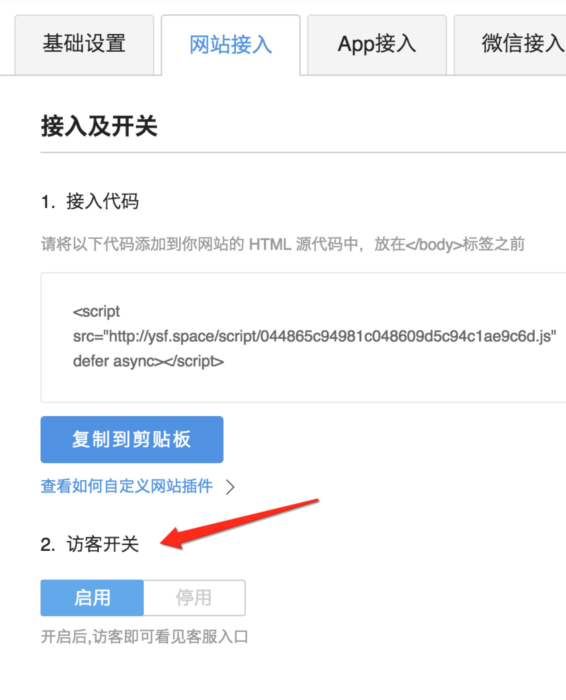

# 七鱼浮层接入说明

## 管理端接入配置
以管理员身份进入管理后台, 在设置下的 **网站接入 ** 设置页面进行设置( **管理系统-> 设置-> 网站接入设置** )。 现阶段七鱼提供了3种接入方式。


## 访客接入方式

```html
    <script src="https://qiyukf.com/script/[APPKEY].js" charset="UTF-8"></script>
```

**浮层入口**

**浮层展示**


### 自定义入口样式

为保证接入按钮的定制化需求，自定义入口图标，需要以下接入方式：
1. 较差的建议: 需要设置hidden参数， hidden 不为零的参数和设置hidden参数， 我们都认为是需要隐藏窗口。 只有在hidden在0的时候我们会显示。
```html
    <a href="#" id="online-service">在线客服</a>
    <!-- hidden设置成 0 或者 1 -->
    <script src="https://qiyukf.com/script/044865c94981c048609d5c94c1ae9c6d.js&hidden=1" charset="UTF-8"></script>
    <!-- hidden-->
    <script src="https://qiyukf.com/script/044865c94981c048609d5c94c1ae9c6d.js&hidden" charset="UTF-8"></script>
    <script>
        document.getElementById('online-service').onclick = function(){
            ysf.open();
        };
    </script>
```
2. 更好的建议: 我们不需要在接入代码中来自定义入口的显示与隐藏，只需要在 **管理端->网站接入** 进行设置



### 浮层模式
如果想开启浮层模式，且需要制定具体用户，则请检查之前的接入代码是否正确
> 注： 在上种情况下， 制定具体用户（ysf.config({uid:'用户名'})）的代码必须写在接入代码之后， 如下所示：

```html
    <a href="#" id="online-service">在线客服</a>
    <script src="https://qiyukf.com/script/044865c94981c048609d5c94c1ae9c6d.js" charset="UTF-8"></script>
    <script>
        ysf.config({
            uid : '用户名'
        });
    </script>

    <script>
        document.getElementById('online-service').onclick = function(){
            ysf.open();
        };
    </script>
```

### 移动端配置设置
为了满足不同平台的需要，七鱼客服接入方式可以自动区别不同平台的接入方式，如果在管理系统开启了浮层模式
1. 浏览器端七鱼会使用浮层模式
2. 移动端七鱼会使用新标签模式

### 浮层模式下自定义窗口
浮层模式下自定义窗口，不会出现消息提醒和消息数, 因此七鱼暴露**unread**事件读取未读消息数和消息的事件和接口,具体使用如下:

```javascript
    /**
     * 返回消息对象
     * @param {String | Object} msg         - type为image|audio, 则message为对象
     * @param {Number} total                - 消息数
     * @param {String} type                 - 消息类型, 如 text, audio, image
     */

    // 事件监听方式
    ysf.on({
        unread : function(msg){
            if(msg.total){
                // 处理逻辑
            }
        }

    });

    // 接口方式
    ysf.unread();

```

### 浮层模式下接入制定用户
在浮层模式下，如果发现用户名没有接入成功，可以如下调整进行设置：

```html
    <!-- 必须在接入脚本代码之前 -->
    <script>
        window.YSFUID = '制定用户名';
    </script>
    <script src="https://qiyukf.com/script/044865c94981c048609d5c94c1ae9c6d.js" charset="UTF-8"></script>
```
