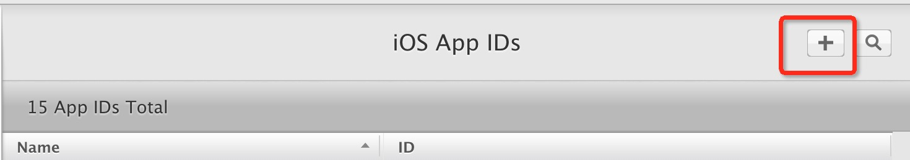
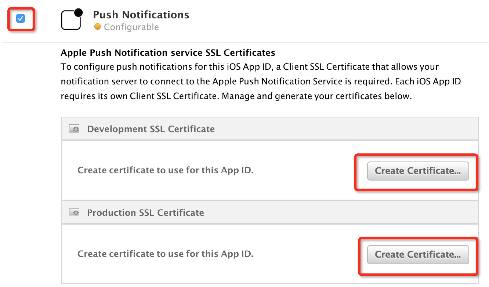
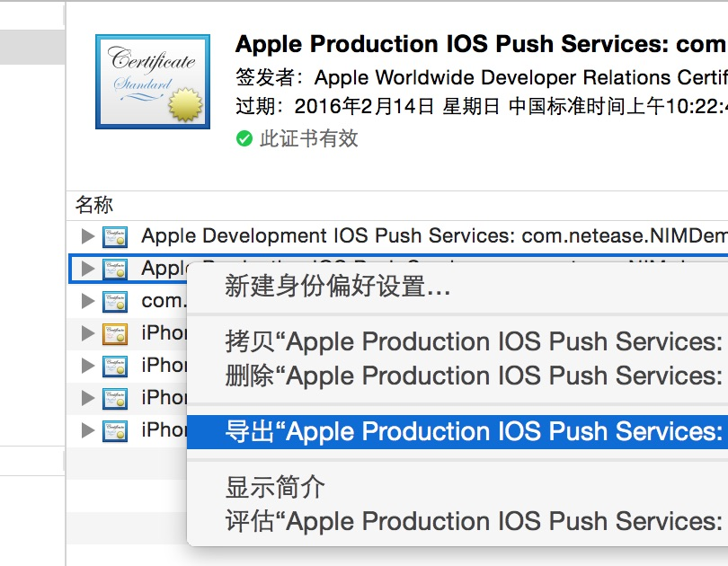
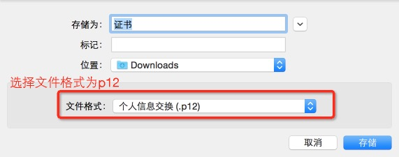
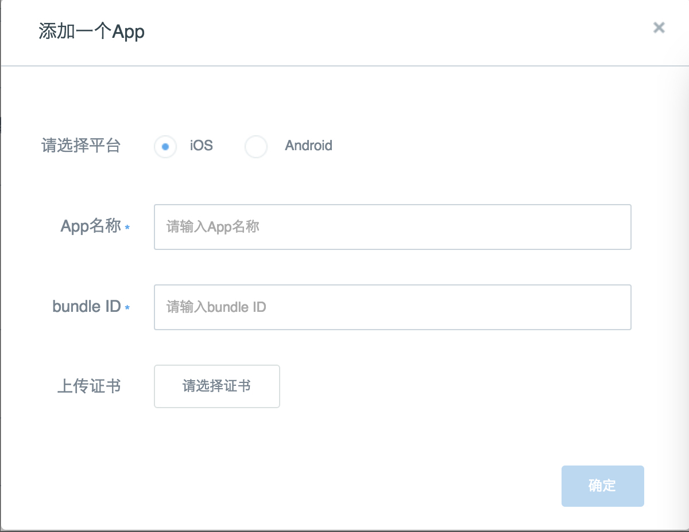

# 制作推送证书p12文件
## 创建应用AppID
 * 登陆 iOS Dev Center 选择进入 Certificates,Identifiers & Profiles。
 
 
 
 * 点击左栏 iOS Apps IDs ,进入 Identifiers - App IDs 列表
  
 
 

 * 点击右侧 “+” 号，创建 App ID

 

## 开启Push&nbsp;Notification
 * 点击创建好的 App，选择 Edit 按钮。
 * 勾选 Push Notifications 功能，点击配置证书按钮，进入配置证书页面。请注意开发证书的种类，开发证书供开发调试使用，生产证书供发布使用。
 
   

## 配置证书
- 在 OSX 系统中点击“钥匙串访问”，生成请求证书。
   
- 在证书信息中填入常用邮件地址，选择保存到磁盘。
   
- 在上一节进入的配置证书页，点击 Continue。
   
- 将刚刚生成的请求证书上传，点击 Generate。
   
- 完成后下载并打开证书，会将证书自动导入钥匙串。
     
     在“钥匙串访问中”的“我的证书”里可以找到刚刚导入的证书。

## 导出推送所需p12文件

 *   选择刚刚导进来的证书，选择右键菜单中的导出选项。
 
   

 *	 保存 p12 文件时，请设置密码，上传证书时需要填写密码。

	

	

        
         
## 通过管理系统上传证书
 *   进入管理系统／设置／接入设置／App接入，点击"添加一个App"。
 *   按图中所示，上传刚刚导出的 p12 文件。
 
    
